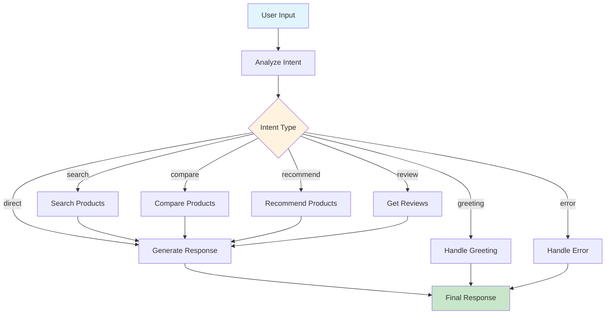

# 🤖 LangGraph Agent Documentation

## Tài liệu chi tiết về E-commerce AI Product Advisor Agent

---

## 📋 Mục lục

1. [Tổng quan](#tổng-quan)
2. [Kiến trúc hệ thống](#kiến-trúc-hệ-thống)
3. [Các thành phần chính](#các-thành-phần-chính)
4. [Luồng xử lý](#luồng-xử-lý)
5. [Quản lý bộ nhớ](#quản-lý-bộ-nhớ)
6. [Tính năng đặc biệt](#tính-năng-đặc-biệt)
7. [API và cách sử dụng](#api-và-cách-sử-dụng)
8. [Troubleshooting](#troubleshooting)

---

## 🎯 Tổng quan

**LangGraph Agent** là một AI Agent thông minh được xây dựng bằng framework LangGraph để tư vấn sản phẩm điện tử. Agent có khả năng:

- 🔍 **Tìm kiếm sản phẩm** thông minh theo yêu cầu người dùng
- ⚖️ **So sánh sản phẩm** chi tiết với nhiều tiêu chí
- 💡 **Gợi ý sản phẩm** phù hợp dựa trên nhu cầu
- 📝 **Xem đánh giá** từ người dùng thực tế
- 🧠 **Nhớ ngữ cảnh** giữa các lần hội thoại
- 🔄 **Hiểu tham chiếu** từ cuộc trò chuyện trước

---

## 🏗️ Kiến trúc hệ thống

### Sơ đồ luồng xử lý



### Kiến trúc thành phần

```
┌─────────────────────────────────────────┐
│            LangGraph Agent              │
├─────────────────────────────────────────┤
│  ┌─────────────┐  ┌─────────────────┐   │
│  │ Agent State │  │  Memory Saver   │   │
│  │             │  │  (LangGraph)    │   │
│  └─────────────┘  └─────────────────┘   │
├─────────────────────────────────────────┤
│  ┌─────────────┐  ┌─────────────────┐   │
│  │ Intent      │  │ Context         │   │
│  │ Analysis    │  │ Detection       │   │
│  └─────────────┘  └─────────────────┘   │
├─────────────────────────────────────────┤
│  ┌─────────────┐  ┌─────────────────┐   │
│  │ Tool        │  │ Response        │   │
│  │ Execution   │  │ Generation      │   │
│  └─────────────┘  └─────────────────┘   │
└─────────────────────────────────────────┘
```

---

## 🧩 Các thành phần chính

### 1. AgentState (Trạng thái Agent)

```python
class AgentState(TypedDict):
    """Trạng thái đầy đủ của Agent trong một phiên hội thoại"""
    
    # Core fields
    messages: Annotated[List[BaseMessage], add_messages]
    user_input: str
    session_id: Optional[str]
    current_step: str
    intent: str
    
    # Tool results
    search_results: Optional[Dict[str, Any]]
    comparison_results: Optional[Dict[str, Any]]
    recommendation_results: Optional[Dict[str, Any]]
    review_results: Optional[Dict[str, Any]]
    
    # Memory & context
    conversation_history: List[Dict[str, str]]
    previous_products: Optional[List[str]]
    context_references: Optional[Dict[str, Any]]
    
    # Metadata
    tools_used: List[str]
    reasoning_steps: List[Dict[str, Any]]
    final_response: Optional[str]
    error_count: int
```

**Chức năng**: Lưu trữ toàn bộ trạng thái của cuộc hội thoại, bao gồm kết quả từ các tools và ngữ cảnh từ các lần chat trước.

### 2. LangGraph Workflow

```python
def _create_graph(self) -> StateGraph:
    workflow = StateGraph(AgentState)
    
    # Các node xử lý
    workflow.add_node("analyze_intent", self._analyze_intent)
    workflow.add_node("handle_greeting", self._handle_greeting)
    workflow.add_node("search_products", self._search_products)
    workflow.add_node("compare_products", self._compare_products)
    workflow.add_node("recommend_products", self._recommend_products)
    workflow.add_node("get_reviews", self._get_reviews)
    workflow.add_node("generate_response", self._generate_response)
    workflow.add_node("handle_error", self._handle_error)
    
    # Định tuyến có điều kiện
    workflow.add_conditional_edges(
        "analyze_intent",
        self._route_intent,
        {
            "greeting": "handle_greeting",
            "search": "search_products",
            "compare": "compare_products",
            "recommend": "recommend_products",
            "review": "get_reviews",
            "direct": "generate_response",
            "error": "handle_error"
        }
    )
    
    return workflow.compile(checkpointer=self.memory_saver)
```

---

## 🔄 Luồng xử lý

### Bước 1: Phân tích ý định (Intent Analysis)

#### A. Nhận biết ngữ cảnh (Context Detection)

```python
def _detect_context_references(self, user_input: str, state: AgentState):
    """Phát hiện tham chiếu đến cuộc hội thoại trước"""
    
    # Patterns so sánh
    comparison_patterns = [
        "so sánh", "compare", "khác nhau", "vs", "versus",
        "2 sản phẩm", "hai sản phẩm", "cả hai", "chúng"
    ]
    
    # Patterns review
    review_patterns = [
        "review", "đánh giá", "nhận xét", "ý kiến",
        "có tốt không", "có đáng mua"
    ]
    
    # Kiểm tra và trả về intent với context
    if any(pattern in user_input.lower() for pattern in comparison_patterns):
        if previous_products and len(previous_products) >= 2:
            return {
                "intent": "compare",
                "products": previous_products[:2],
                "reason": "Tham chiếu so sánh từ sản phẩm trước"
            }
```

**Ví dụ thực tế**:
- Lần 1: "Tìm laptop Dell" → Agent tìm và lưu danh sách laptop Dell
- Lần 2: "So sánh chúng" → Agent hiểu "chúng" = laptop Dell vừa tìm

#### B. Phân loại ý định bằng LLM

```python
def _classify_intent_with_llm(self, user_input: str) -> str:
    """Sử dụng LLM để phân loại ý định thông minh"""
    
    prompt_template = prompt_manager.get_prompt(PromptType.INTENT_CLASSIFICATION)
    intent_prompt = prompt_template.format(user_input=user_input)
    
    response = self.llm.invoke([HumanMessage(content=intent_prompt)])
    intent = response.content.strip().lower()
    
    # Validate intent
    valid_intents = ["greeting", "search", "compare", "recommend", "review", "direct"]
    return intent if intent in valid_intents else None
```

#### C. Fallback Rules-based

```python
def _classify_intent_with_rules(self, user_input: str) -> str:
    """Phương pháp dự phòng dựa trên rules"""
    
    if any(word in user_input for word in ["xin chào", "hello", "hi"]):
        return "greeting"
    elif any(word in user_input for word in ["so sánh", "compare", "vs"]):
        return "compare"
    elif any(word in user_input for word in ["gợi ý", "recommend", "tư vấn"]):
        return "recommend"
    elif any(word in user_input for word in ["tìm", "search", "laptop", "smartphone"]):
        return "search"
    else:
        return "direct"
```

### Bước 2: Thực thi công cụ (Tool Execution)

#### A. Tìm kiếm sản phẩm (Search Products)

```python
def _search_products(self, state: AgentState) -> AgentState:
    # 1. Trích xuất tham số tìm kiếm bằng LLM
    search_params = self._extract_search_params(state["user_input"])
    
    # 2. Gọi search tool
    search_input = json.dumps(search_params, ensure_ascii=False)
    result = search_tool.run(search_input)
    
    # 3. Lưu kết quả và reasoning
    state["search_results"] = result
    state["reasoning_steps"].append({
        "action": "search_products",
        "thought": f"Tìm kiếm với params: {search_params}",
        "observation": result
    })
```

**Trích xuất tham số thông minh**:

```python
def _extract_search_params(self, user_input: str) -> Dict[str, Any]:
    """LLM trích xuất tham số từ ngôn ngữ tự nhiên"""
    
    # Input: "Tìm laptop Dell dưới 20 triệu cho sinh viên"
    # Output: {
    #     "query": "laptop Dell sinh viên",
    #     "metadata": {
    #         "category": "laptop",
    #         "brand": "dell", 
    #         "price_max": 20000000,
    #         "usage_purpose": "study",
    #         "max_results": 3
    #     }
    # }
```

#### B. So sánh sản phẩm (Compare Products)

```python
def _compare_products(self, state: AgentState) -> AgentState:
    # 1. Kiểm tra context products trước
    if state.get("context_products"):
        compare_params = {
            "product_names": state["context_products"],
            "comparison_aspects": ["giá", "hiệu năng", "thiết kế"]
        }
    else:
        # 2. Trích xuất từ user input
        compare_params = self._extract_compare_params(state["user_input"])
    
    # 3. Thực thi comparison tool
    result = compare_tool.run(json.dumps(compare_params))
```

#### C. Gợi ý sản phẩm (Recommend Products)

```python
def _recommend_products(self, state: AgentState) -> AgentState:
    # Trích xuất nhu cầu và ngân sách
    recommend_params = self._extract_recommend_params(state["user_input"])
    
    # Input: "Gợi ý laptop gaming dưới 30 triệu"
    # Extracted: {
    #     "user_needs": "laptop gaming",
    #     "metadata": {
    #         "category": "laptop",
    #         "budget_max": 30000000,
    #         "usage_purpose": "gaming",
    #         "priority_features": ["performance", "graphics"]
    #     }
    # }
```

### Bước 3: Tạo phản hồi (Response Generation)

```python
def _generate_response(self, state: AgentState) -> AgentState:
    # 1. Thu thập context từ tất cả tools
    context_parts = []
    if state.get("search_results"):
        context_parts.append(f"Search: {state['search_results']}")
    if state.get("comparison_results"):
        context_parts.append(f"Compare: {state['comparison_results']}")
    
    # 2. Tạo input cho RAG tool
    rag_input = {
        "user_query": state["user_input"],
        "intent": state["intent"],
        "context": "\n".join(context_parts),
        "conversation_history": conversation_history_text,
        "tools_used": state["tools_used"]
    }
    
    # 3. Generate natural response
    result = generation_tool.run(rag_input)
    state["final_response"] = result["response"]
```

---

## 🧠 Quản lý bộ nhớ

### Native LangGraph Memory

```python
class ProductAdvisorLangGraphAgent:
    def __init__(self):
        # LangGraph native memory management
        self.memory_saver = MemorySaver()
        self.graph = self._create_graph()
    
    def _create_graph(self) -> StateGraph:
        workflow = StateGraph(AgentState)
        # ... add nodes ...
        
        # Compile với memory checkpointer
        return workflow.compile(checkpointer=self.memory_saver)
```

### Lưu trữ ngữ cảnh hội thoại

```python
def _get_conversation_history(self, session_id: str) -> Dict[str, Any]:
    """Lấy lịch sử hội thoại từ LangGraph checkpoints"""
    
    thread_config = {"configurable": {"thread_id": session_id}}
    checkpoints = list(self.graph.get_state_history(config=thread_config))
    
    # Trích xuất previous_products cho context reference
    previous_products = self._extract_product_names_from_results(latest_state)
    
    return {
        "conversation_history": conversation_list,
        "previous_products": previous_products,
        "context_references": context_refs
    }
```

### Trích xuất sản phẩm cho ngữ cảnh

```python
def _extract_product_names_from_results(self, state: Dict[str, Any]) -> List[str]:
    """Trích xuất tên sản phẩm từ kết quả các tool"""
    
    product_names = []
    
    # Từ search results
    if state.get("search_results"):
        search_data = json.loads(state["search_results"])
        if search_data.get("success") and "products" in search_data:
            for product in search_data["products"]:
                product_names.append(product.get("name", ""))
    
    # Từ recommendation results  
    if state.get("recommendation_results"):
        # Similar extraction logic...
    
    return list(set(product_names))  # Remove duplicates
```

---

## ✨ Tính năng đặc biệt

### 1. ReAct-style Reasoning

Agent ghi lại quá trình suy nghĩ như con người:

```python
reasoning_step = {
    "step": 1,
    "action": "search_products",
    "thought": "Người dùng muốn tìm laptop Dell dưới 20 triệu cho sinh viên",
    "action_input": {"category": "laptop", "brand": "dell", "price_max": 20000000},
    "observation": "Tìm thấy 3 sản phẩm: Dell Inspiron 15 3000, Dell Vostro 3400, Dell Latitude 3420"
}
```

### 2. Intelligent Parameter Extraction

Sử dụng LLM với prompt templates để trích xuất thông tin:

```python
# Input: "Tìm smartphone Samsung có camera tốt dưới 15 triệu"
# LLM extracts:
{
    "category": "smartphone",
    "brand": "samsung", 
    "price_max": 15000000,
    "priority_features": ["camera"],
    "max_results": 3
}
```

### 3. Context-Aware Conversation

```python
# Conversation flow:
# User: "Tìm laptop Dell"
# Agent: [Tìm và hiển thị 3 laptop Dell] + lưu vào previous_products

# User: "So sánh chúng"  
# Agent: Nhận biết "chúng" = 3 laptop Dell → Tự động so sánh

# User: "Có gì tốt hơn?"
# Agent: Hiểu ngữ cảnh → Gợi ý laptop khác tương tự
```

### 4. Multi-layered Error Handling

```python
# Layer 1: LLM extraction
try:
    params = self._extract_search_params_with_llm(user_input)
except:
    # Layer 2: Rule-based fallback
    params = self._fallback_search_params(user_input)

# Layer 3: Error node
workflow.add_node("handle_error", self._handle_error)
```

### 5. Adaptive Response Generation

```python
def _get_error_response(self, error: str) -> str:
    """Smart error responses based on error type"""
    
    if "setup_required" in error:
        return """❌ **Cơ sở dữ liệu chưa được thiết lập**
        
🔧 **Cách khắc phục:**
1. Chạy: `python scripts/insert_sample_data.py`
2. Tạo Pinecone index 'ecommerce-products'
        
💡 Sau đó thử lại câu hỏi!"""
    else:
        return f"Xin lỗi, có lỗi: {error}. Bạn thử lại được không?"
```

---

## 🔧 API và cách sử dụng

### Khởi tạo Agent

```python
from src.agents.langgraph_agent import get_langgraph_agent_manager

# Get agent manager
agent_manager = get_langgraph_agent_manager()
agent = agent_manager.get_agent()
```

### Chat với Agent

```python
# Chat đơn giản
response = agent.chat("Tìm laptop Dell dưới 20 triệu")

# Chat với session management
session_id = "user123"
response = agent.chat("Tìm laptop Dell", session_id=session_id)

# Chat tiếp theo với context
response2 = agent.chat("So sánh chúng", session_id=session_id)
```

### Response Format

```python
{
    "response": "Tôi tìm thấy 3 laptop Dell phù hợp...",
    "tools_used": ["search_products", "answer_with_context"],
    "reasoning_steps": [
        {
            "step": 1,
            "action": "search_products", 
            "thought": "Tìm laptop Dell với giá dưới 20 triệu",
            "observation": "Tìm thấy 3 sản phẩm phù hợp"
        }
    ],
    "session_id": "user123",
    "success": True,
    "intent": "search",
    "context_info": {
        "has_previous_context": False,
        "previous_products": [],
        "context_references_used": False
    }
}
```

### Quản lý Session

```python
# Clear specific session
agent_manager.clear_session("user123")

# Clear all sessions  
agent_manager.clear_all_sessions()

# Get active sessions
sessions = agent_manager.get_active_sessions()
```

---

## 🔍 Troubleshooting

### Lỗi thường gặp

#### 1. Database Not Setup

```
❌ Lỗi: setup_required hoặc NOT_FOUND
🔧 Giải pháp: 
   python scripts/insert_sample_data.py
   Kiểm tra Pinecone index đã tạo chưa
```

#### 2. LLM Intent Classification Failed

```python
# Agent tự động fallback sang rule-based
def _classify_intent_with_rules(self, user_input: str) -> str:
    # Backup classification logic
```

#### 3. Tool Execution Failed

```python
# Error handling trong mỗi tool node
except Exception as e:
    state["search_results"] = {"error": str(e), "success": False}
    state["error_count"] += 1
```

#### 4. Memory Issues

```python
# Reset memory nếu cần
agent.clear_memory(session_id)

# Hoặc tạo agent mới
agent_manager = LangGraphAgentManager()
```

### Debug Tips

```python
# 1. Kiểm tra reasoning steps
print(response["reasoning_steps"])

# 2. Xem tools được sử dụng
print(response["tools_used"])

# 3. Kiểm tra context info
print(response["context_info"])

# 4. Debug state transitions
# Thêm logging trong các node methods
```

---

## 📊 Performance & Metrics

### Thống kê sử dụng

```python
# Tracking trong AgentState
{
    "tools_used": ["search_products", "answer_with_context"],
    "iteration_count": 1,
    "error_count": 0,
    "reasoning_steps": [...]  # Detailed execution trace
}
```

### Memory Usage

```python
# LangGraph tự động quản lý memory
# Conversation history được giới hạn (last 5 conversations)
if len(state["conversation_history"]) > 5:
    state["conversation_history"] = state["conversation_history"][-5:]
```

---

## 🚀 Mở rộng và tùy chỉnh

### Thêm Intent mới

```python
# 1. Thêm vào valid_intents
valid_intents = ["greeting", "search", "compare", "recommend", "review", "direct", "new_intent"]

# 2. Tạo node xử lý
workflow.add_node("handle_new_intent", self._handle_new_intent)

# 3. Thêm routing
workflow.add_conditional_edges(
    "analyze_intent",
    self._route_intent,
    {
        # ... existing routes ...
        "new_intent": "handle_new_intent"
    }
)
```

### Thêm Tool mới

```python
# 1. Tạo tool trong tool_manager
def _handle_new_functionality(self, state: AgentState) -> AgentState:
    new_tool = self.tool_manager.get_tool("new_tool")
    result = new_tool.run(input_data)
    state["new_results"] = result
    return state
```

### Custom Prompt Templates

```python
# Thêm prompt mới trong prompt_manager
class PromptType(Enum):
    # ... existing types ...
    NEW_EXTRACTION = "new_extraction"

# Sử dụng
prompt_template = prompt_manager.get_prompt(PromptType.NEW_EXTRACTION)
```

---

## 📝 Kết luận

LangGraph Agent là một implementation tinh vi của conversational AI với:

✅ **Ưu điểm**:
- Modular architecture dễ mở rộng
- Native memory management với LangGraph
- Context-aware conversations  
- Intelligent parameter extraction
- Robust error handling
- ReAct-style reasoning

⚠️ **Lưu ý**:
- Cần thiết lập database trước khi sử dụng
- LLM API keys phải được cấu hình đúng
- Memory được quản lý tự động bởi LangGraph

🔮 **Hướng phát triển**:
- Thêm more sophisticated context understanding
- Multi-modal input support (images, voice)
- Advanced personalization
- Real-time learning from user feedback

---

*Tài liệu này được tạo vào ngày 22/08/2025 cho phiên bản LangGraph Agent v1.0*
